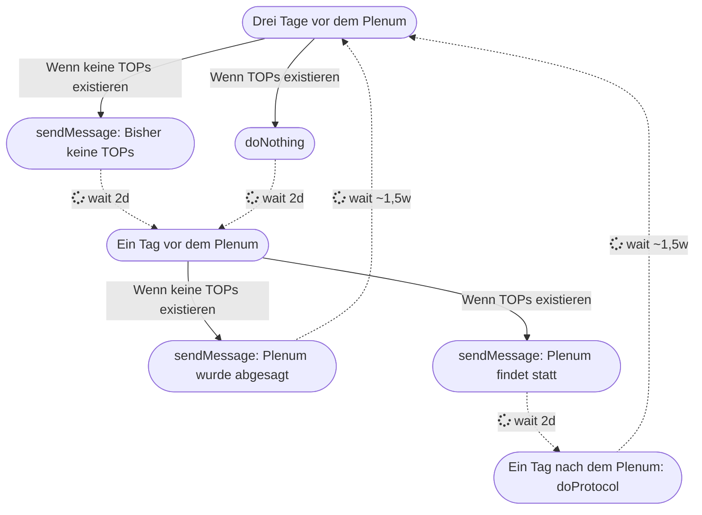

## Die initiale Idee

Ich engagiere mich nun schon seit Sommer 2023 im Chaos Computer Club Berlin und habe dort mit ein paar anderen Personen dafür gesorgt, dass nach Corona wieder regelmäßig Plena im Club statt finden. Es gibt bei den Plena immer das Folgende Standardprotokoll:

Bei jedem Plenum wird ein Plenumspad in Hedgedoc erstellt. Hedgedoc ist eine selbst gehostete Website, auf der man Markdown-Dateien live bearbeiten kann. Diese Plenumspads werden während des Plenums beschrieben und später in unser eigenes Mediawiki eingepflegt. Dabei nutzen wir Pandoc.

Damit werden am Ende alle Plena in Textform im Mediawiki festgehalten - so, dass sie jeder mit Passwortzugang einsehen kann.

*Yrrsinn* und ich übernahmen bei den Plena immer den Job, diese vorher anzukündigen und Pad-Templates herumzuschicken, die wir nach dem Plenum im Mediawiki veröffentlichten und eine Mail mit dem neuen Link herumschickten.

Dieser Prozess war, wie man sich vielleicht vorstellen kann, zwar in ein paar Minuten erledigt, aber wurde oft von uns vergessen. Außerdem war er potentiell vergleichsweise einfach automatisierbar. Also plante ich, den Plenums-Bot ins Leben zu rufen 

_Das Plenum-Bot Projekt in VSCode_

## Wie umsetzen?

Zum Zeitpunkt, an dem ich mit dem Projekt anfing, lernte ich schon seit ein paar Monaten Rust und wählte deshalb diese Programmiersprache. Schon zum Anfang gab es einige Personen, die mir rieten, den Bot in einfacheren Sprachen wie Python oder direkt in Bash zu bauen, was im Nachhinein wahrscheinlich auch eine bessere Idee gewesen wäre. Ich entschied mich aber für Rust, da ich diese Sprache zu dem Zeitpunkt schlicht am besten kannte.

Das Projekt wurde nach einiger Zeit von *nobody* unterstützt, ohne den der Bot wahrscheinlich nie so weit entwickelt worden wäre.

### Hedgedoc und Pandoc

Eine der ersten Aufgaben war es, das Pad von Hedgedoc herunterzuladen. Das war aber relativ einfach, man musste nur an die Pad-URL ein `/download` packen. Das Pad wurde dann in Pandoc mit einem Shell-Befehl umgewandelt.

### MediaWiki

Das hochladen zu MediaWiki erwies sich als deutlich schwieriger: Zunächst musste man einen Bot-Token in MediaWiki kreieren, welcher einem Passwort ähnelt und damit auch vertraulich behandelt werden muss. Dann musste man sich bei jedem Durchlauf mit diesem Token einloggen, um einen `login_token` zu erhalten, den man zum Authentifizieren benötigte. Mit diesem `login_token` holte man sich dann einen `csrf_token`, der zum Bearbeiten von MediaWiki-Content notwendig war. Danach erst konnte man Seiten bearbeiten.
Der Bot erstellt jedes Mal, wenn `pad_ins_wiki()` aufgerufen wurde und nachdem er sich authentifiziert hat, eine neue Wikiseite unter `Plenum/[aktuelles_datum]`, in die er das konvertierte Pad hochlädt (z. B. unter Plenum/10.\_Dezember_2024). Danach wird auf der Plenum-Hauptseite ein Link zu der neu generierten Plenumsseite erstellt.

### E-Mail

Die Mitglieder des Clubs sollten ja, wie vorhin beschrieben, kurz vor und kurz nach dem Plenum eine E-Mail bekommen. Dazu erstellten wir eine eigene Mailadresse, die wir dem internen Verteiler hinzufügten. Wir nutzten die crate `lettre`, mit der wir dafür sorgten, dass die Mails immer so abgeschickt wurden, dass als Erstes eine Erinnerungsmail mit _"In 3 Tagen ist Plenum"_ abgeschickt wurde, dann _"in 1 Tag ist Plenum"_ und dann einen Tag nach dem Plenum _"Hier ist das Plenumspad:"_. Zur besseren Übersichtlichkeit war es uns dabei aber wichtig, dass immer auf die erste der drei Mails geantwortet wurde, damit man die Mails als zusammenhängenden Thread im jeweiligen E-Mail-Client hatte.

### Der Key Value Store

Wir wollten logischerweise keine Passwörter für E-Mail, MediaWiki und ähnlichem im Klartext im Code speichern. Das wäre deutlich zu unsicher und für immer in der Git History. Deshalb verwendeten wir die crate `rusqlite`, um einen Key-Value Store zu entwerfen. Der Key Value Store wurde in jeder der Dateien angelegt und es wurde definiert, welche Variablen verwendet werden sollten. Wir fügten verschiedene Arten von Config Feldern hinzu:
- Mit `Default` konnte man einen Standardwert festlegen, der bei keiner Konfiguration verwendet wurde, wie z.B. Server URLs.
- Mit  `Password` kann man werden Werte festlegen, die im Terminal durch \*\*\* ersetzt werden. 
- Mit `Optional` kann man Werte festlegen, die, wenn sie nicht angegeben werden, keine Fehler erzeugen, wie die `message_id`s der letzten E-Mails, die z.B. beim ersten Start natürlich nicht existieren sollen.  
- Mit `Generated` wird immer ein Generator angegeben, der bei nicht vorhandenen Datenbankwerten einfach einen neuen Wert generiert, wie z.B. die neuen Padlinks für Hedgedoc.
- Mit `Silent` werden Werte definiert, die nicht im Terminal beim bearbeiten der Config angezeigt werden.

Damit können wir für alle einzelnen Dienste Passwörter und andere Konfigurationen abspeichern. Dazu fügten wir ebenfalls ein Command Line Interface (CLI) ein, das man mit einem `-c` am Ende aufrufen kann, um die Config zu ändern.

_Der Key Value Store in Benutzung_

### Matrix

Außerdem implementierten wir den bestehenden Matrix-Client aus dem Python Script des Status-Displays im Club neu in Rust. Dabei sollte dasselbe Verhalten wie bei der Mail sein, nur dass die Nachrichten etwas knapper gehalten wurden. Dazu wurde ein Matrix-Account erstellt, von dem der API-Key und die Gruppen, in die die Nachrichten gesendet werden sollen, in die Config geschrieben wurden. So kann man diese, wie die anderen Dienste, ebenfalls später in der Config ändern, ohne den Code anzufassen.

## Der Ablauf

Um den Ablauf der Aufgaben abzubilden wurde eine State Machine implementiert, die zu jedem möglichen Zustand definierte, was zunächst zu tun war. Dabei gab es für jedes Plenum 3 Events, an denen etwas passieren soll:

#### 1) 3 Tage vor dem Plenum

An diesem Tag soll der Bot schauen, ob es in dem Plenumspad einen TOP gibt. Wenn eins existiert, soll er nichts tun, und wenn keins existiert, soll er eine Mail mit der Info schicken, dass es gerade keine TOPs gibt und das Plenum eventuell nicht stattfinden könnte.

#### 2) 1 Tag vor dem Plenum

An diesem Tag gibt es ebenfalls zwei Möglichkeiten:

- Wenn es TOPs gibt, wird eine Erinnerung mit den TOPs und der Info, dass das Plenum heute statt findet, raus geschickt.
- Wenn es keine TOPs gibt, wird das Plenum abgesagt

#### 3) 1 Tag nach dem Plenum

An diesem Tag gibt es wieder zwei Möglichkeiten:

- Wenn das Plenum statt gefunden hat, wird das Plenumspad heruntergeladen, auf MediaWiki hochgeladen und eine Nachricht mit dem Pad auf Element und per Mail herumgeschickt
- Wenn kein Plenum statt gefunden hat (und es damit keine TOPs gab) wird keine E-Mail rausgeschickt und im Wiki ein "Hat nicht statt gefunden" protokolliert

## Der aktuelle Stand

Und, was ist mein Fazit? Wäre es einfacher gewesen, das Ganze in Python zu schreiben? Ja, ich denke schon. Aber ich habe dieses Projekt nicht nur aus praktischen Gründen gemacht, sondern auch, um meine Rust-Kenntnisse zu verbessern. Mit insgesamt ~2800 Zeilen Code, verteilt auf 19 Dateien, ist das Projekt vergleichsweise schon ziemlich explodiert.

Im Moment ist der Bot noch in Arbeit. Die Grundlogik ist zwar schon fertig, aber es fehlen noch Langzeittests, um zu sehen, ob alle Reminder funktionieren.

Also: To be continued...

## <i class="fa-solid fa-code-compare"></i>  Source Code des Plenum-Bots
Der Source Code ist auf dem Forjeo des Chaos Computer Club Berlin unter diesem Link zu finden:

[git.berlin.ccc.de/murmeldin/plenum-bot](https://git.berlin.ccc.de/murmeldin/plenum-bot)